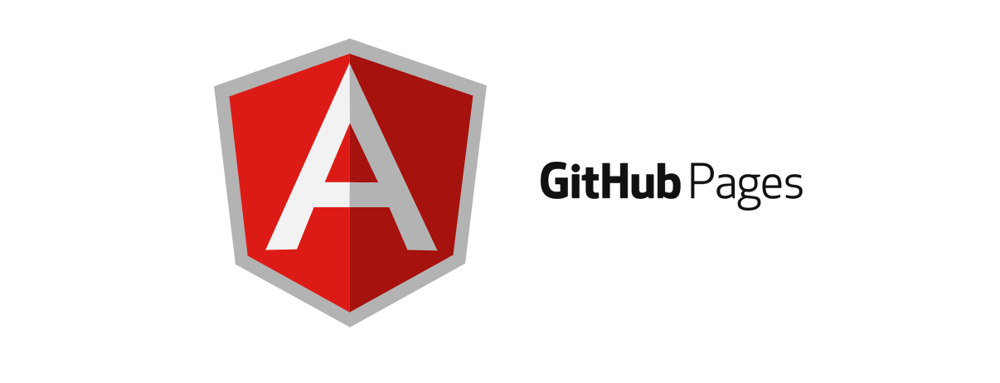
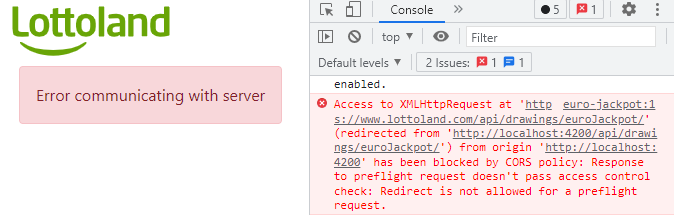
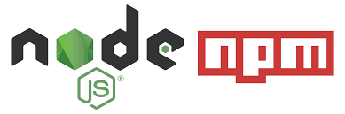
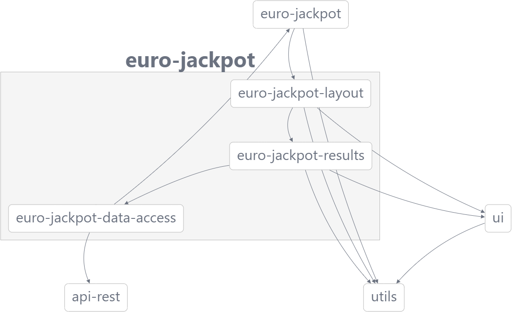

# Lottoland - EuroJackpot

This project is a web application that let to user know the latest results of EuroJackpot lottery.

  

This project was built using [Angular](https://angular.io) and [Nx](https://nx.dev), to enhance the productivity in Angular ecosystem.

# Quick Start

## Browse to the application

The application is hosted using Github Pages, and it can be visited in the URL:

[https://jagcolombat.github.io/](https://jagcolombat.github.io/)

## Restricted by cross-domain 

If the application show a restriction by Cross-domain, feel free to use any solution to jump this restriction.

### Here there is one solution:

If you are in Windows OS and have installed Chrome browser, do it.

Open your chrome with this configuration:

- `chrome.exe  --user-data-dir="C://Chrome dev session" -disable-web-security`

You can run it "Run Window" (Win + R)

When the Chrome is opened, set the URL [https://jagcolombat.github.io/](https://jagcolombat.github.io/)

# Run the application locally:

## With Docker:

First, make sure you have Docker installed in your system.

1. Clone this repo
2. Move inside root directory and execute this command to build the docker image:
- `docker build -t lottoland/eurojackpot-results-image:latest`  .

3. If all was succesfully, run the built image with this other command:
- `docker run -d -p 8080:80 lottoland/eurojackpot-results-image:latest`

4. Finally open your browser and navigate to [http://localhost:8080](http://localhost:8080)

## Without Docker:

First, make sure you have NodeJS 10 or superior and respective NPM installed in your system.

1. Clone this repo
2. Move inside root directory and execute this command
- `npm install` 

3. If all was succesfully, run the application with following command:
- `npm run start`

4. Finally open your browser and navigate to [http://localhost:4200](http://localhost:4200)

# Architecture:

  

The application follow a architecture of monorepo and it is distributed in a Angular application and several Angular Libs.

Almost all bussiness concerns of the application are groups in the libraries, letting to reuse these in other posible applications, related to EuroJackpot or Lottoland.

  

- App: EuroJackpot

  - AppComponent: Entry point of aplication, load main component for EuroJackpot layout
  - Routing: The aplication has a one route which load in lazy mode EuroJackpot layout library

- Libs: 
  - EuroJackpot:
	  - Layout: 
		  - MainLayout: Define the generic layout
		  - EuroJackpotLayout: Based in MainLayout orchest the pieces of code (header, router-outlet) that must be in the main layout.
	  - DataAccess: Services for retrieve Eurojackpot data (consuming endpoint)
	  - Results: Orchest the flow for get, transform and present the lottery results, by a container component and service resolver
  - ApiRest: Generic service for consuming REST APIs
  - UI: Atomic components for represent data
  
      Winner numbers, Result item, Result grid, Result date
  - Utils:
    - Enums: Enumeratives for tier and match values
	- Models: Classes and interfaces of base structures
	- Services: Helper services like loading indicator
	- Functions: Helper functions for transform data

- Third party libraries:
    Also of Angular and Narwhal libraries, this application use other important third party libraries like Bootstrap, Angular Flex Layout and NgxSpinner
	
Contact:

Any suggestion or doubts please contact me using this accounts.

- E-mail: jagcolombat@gmail.com
- GitHub: [@jagcolombat](https://github.com/jagcolombat)

